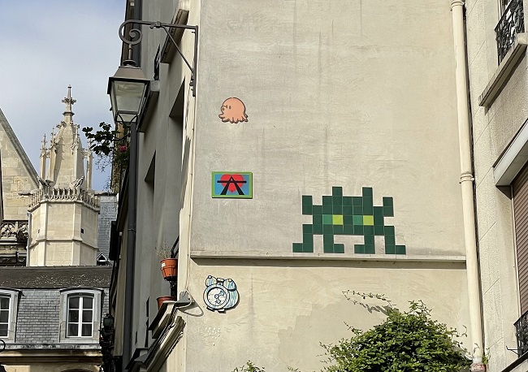

# 🎨 GitHub Pixel Art – Space Invader à Paris

Bienvenue dans **GitHub Pixel Art** !

Ce dépôt permet de **planifier et générer des motifs** sur ma grille de contributions GitHub, en transformant chaque jour de commit en un pixel de couleur sur ta grille.
Mais attention… ce n’est pas un projet comme les autres : **Paris est envahi par les Space Invaders**, et certains se cachent dans ma grille GitHub… saurez-vous les repérer ?



---

## 🌟 Histoire

Chaque curieux à Paris sait que la ville cache ses secrets…
Moi, dev parisien, j’ai décidé de laisser un **Space Invader discret** dans mon GitHub, infiltré dans ma grille de contributions.
Il apparaît chaque jour, **injecté par celui qui est sur la banner**, et se cache parmi mes commits.
Qui sera le premier à le découvrir ? 🔍

Chaque case verte de ta grille représente une journée active, et chaque “1” dans la matrice est un pixel du Space Invader qui prend vie.
L’inspiration vient de **l’invasion des Space Invaders sur Paris**, mais cette fois-ci, le jeu se joue directement dans ton profil GitHub !

---

## 🕹️ Première matrice : Space Invader

Voici le tout premier motif utilisé, un **mini Space Invader** dans une grille 7x10 (jours x semaines) :

```python
// year: 2025  cols: 53
pattern = [
  [0,0,0,0,0,0,0,0,0,0,0,0,0,0,0,0,0,0,0,0,0,0,0,0,0,0,0,0,0,0,0,0,0,0,0,0,0,0,0,0,0,0,0,0,0,1,0,0,1,0,0,0,0],  # dim
  [0,0,0,0,0,0,0,0,0,0,0,0,0,0,0,0,0,0,0,0,0,0,0,0,0,0,0,0,0,0,0,0,0,0,0,0,0,0,0,0,0,0,1,0,1,1,1,1,1,0,1,0,0],  # lun
  [0,0,0,0,0,0,0,0,0,0,0,0,0,0,0,0,0,0,0,0,0,0,0,0,0,0,0,0,0,0,0,0,0,0,0,0,0,0,0,0,0,0,1,1,1,1,1,1,1,1,1,0,0],  # mar
  [0,0,0,0,0,0,0,0,0,0,0,0,0,0,0,0,0,0,0,0,0,0,0,0,0,0,0,0,0,0,0,0,0,0,0,0,0,0,0,0,0,0,0,1,0,0,1,0,0,1,0,0,0],  # mer
  [0,0,0,0,0,0,0,0,0,0,0,0,0,0,0,0,0,0,0,0,0,0,0,0,0,0,0,0,0,0,0,0,0,0,0,0,0,0,0,0,0,0,1,1,1,1,1,1,1,1,1,0,0],  # jeu
  [0,0,0,0,0,0,0,0,0,0,0,0,0,0,0,0,0,0,0,0,0,0,0,0,0,0,0,0,0,0,0,0,0,0,0,0,0,0,0,0,0,0,1,0,1,0,0,0,1,0,1,0,0],  # ven
  [0,0,0,0,0,0,0,0,0,0,0,0,0,0,0,0,0,0,0,0,0,0,0,0,0,0,0,0,0,0,0,0,0,0,0,0,0,0,0,0,0,1,1,0,1,1,0,1,1,0,1,1,0],  # sam
]
```

> Chaque `1` correspond à une case verte (active), chaque `0` correspond à une case vide.
> Ce motif est le tout premier **easter egg** caché dans mon GitHub.

---

## 🚀 Fonctionnalités

* Grille interactive **7x52 semaines** (année actuelle)
* **Cases cliquables** pour créer ton motif
* **Jours hors année grisées**
* **Export automatique** de la matrice pour Python ou autre
* Indication de la **case correspondant à aujourd'hui**
* Total des contributions pris en compte pour reproduire la couleur exacte de GitHub
* **Mise en évidence de la case du jour** pour ne jamais perdre ton pixel magique

---

## 🎮 Usage

1. Ouvrir le fichier `index.html` ou le **CodePen lié**.
2. Cliquer sur les cases pour créer ton dessin.
3. Exporter la matrice via le bouton **Exporter la matrice**.
4. (Optionnel) Ajouter la matrice au workflow pour générer les commits automatiquement et laisser tes Space Invaders s’infiltrer dans la grille.

---

## 🕵️ Easter Egg

⚠️ Chaque jour, un **Space Invader** apparait dans la grille.
Certains sont **discrets et presque invisibles**, mais si vous regardez attentivement… le premier qui le trouve pourra crier :

> “J’ai trouvé le Space Invader infiltré dans le Git de Paris !”

Il n’y a **pas de récompense financière**, cependant… sauf ce tas de billets :

```
🪙🪙🪙🪙🪙🪙🪙🪙🪙🪙🪙🪙🪙🪙🪙✨✨
🪙🪙🪙🪙🪙💵🪙🪙💵🪙🪙🪙🪙🪙🪙🪙✨✨✨
🪙🪙💵🪙💵💵💵💵💵🪙💵🪙🪙🪙🪙✨✨
🪙🪙💵💵💵💵💵💵💵💵💵🪙🪙🪙✨
🪙🪙🪙💵👽💰💵👽💰💵🪙🪙🪙🪙🪙✨✨
🪙🪙💵💵💵💵💵💵💵💵💵🪙🪙🪙🪙🪙✨✨✨
🪙🪙💵🪙💵🪙🪙🪙💵🪙💵🪙🪙🪙🪙✨
🪙💵💵🪙💵💵🪙💵💵🪙💵💵🪙🪙🪙✨✨
🪙🪙🪙🪙🪙🪙🪙🪙🪙🪙🪙🪙🪙🪙🪙🪙✨✨
```

L’inspiration : **les Space Invaders ont envahi Paris**, mais toi tu peux être le premier à les repérer…
Qui aura l’œil de lynx pour dénicher celui caché dans ma grille ?

---

## 💡 Bonus

* Adaptation automatique à l’année courante
* Possibilité d’injecter tes propres motifs ou **nouveaux easter eggs** dans la grille
* Démo live possible sur **CodePen** pour tester la grille interactive et visualiser les Space Invaders en action

---

> Préparez vos yeux et vos commits… Paris n’a jamais été aussi pixelisé ! 🛸
